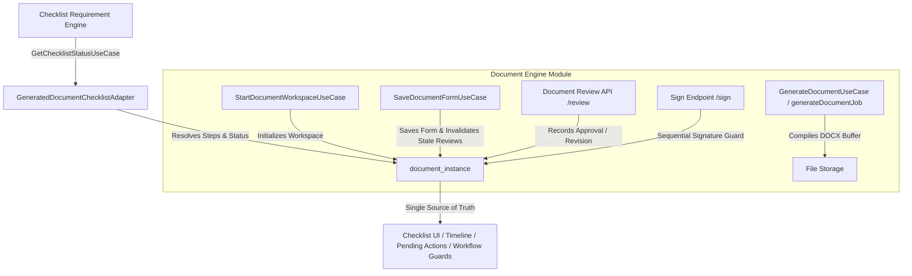

# Document Engine (Workspace) Documentation

The Document Engine is a Clean Architecture module responsible for managing the complete statutory document lifecycle (**`GENERATE` $\rightarrow$ `ADDITIONAL_INFO` $\rightarrow$ `REVIEW` $\rightarrow$ `SIGN` $\rightarrow$ `COMPLETED`**), dynamic forms, document review/vetting, permission-driven sequential signatures, and dual-format document streaming. It relies on the pure core engine (`src/lib/engines/docx`) for actual zip and XML manipulation.

---

## Core Architecture



- **Core Engine (`src/lib/engines/docx`)**: Pure, stateless `.docx` generation logic with `nullGetter()` protection.
- **Application Layer (`src/modules/document-engine/application/use-cases`)**: Clean Use Cases (`StartDocumentWorkspaceUseCase`, `GenerateDocumentUseCase`, `SaveDocumentDocumentUseCase`).
- **API Layer (`src/app/api/document-engine`)**: Secure REST API endpoints orchestrating Use Cases (`/workspace`, `/generate`, `/sign`, `/save-form`, `/review`).
- **Shared UI (`src/shared/components/coalrr/DocumentWorkspaceModal.tsx`)**: Reusable platform UI workspace with dynamic forms, document review history card, auto-collapsible panels, sequential signature workflows, and dual format downloads.
- **File Management & HTML Preview (`FilePreview.tsx`)**: Renders `.docx` documents instantly in-browser using `mammoth.convertToHtml()`.

---

## Complete Document Requirement Lifecycle

The Document Engine integrates directly with the **Checklist Requirement Engine** via [`GeneratedDocumentChecklistAdapter.ts`](file:///d:/coalrrnextjs/src/core/checklist/services/GeneratedDocumentChecklistAdapter.ts). Every statutory document requirement resolves a step sequence configured in `checklist_requirement_rule.input_schema.completion_steps`.

### 1. Configured Lifecycle Steps

| Step | Action Required | Evidence Collected | Permission Required |
| :--- | :--- | :--- | :--- |
| **`GENERATE`** | Initial document compilation from domain placeholders | `instance.generated_docx_path` is not null | `<template>.generate` / `document.generate` |
| **`ADDITIONAL_INFO`** | Submitting user input fields in dynamic form | `instance.form_data` is saved & non-empty | `<template>.additional_info` / `document.edit` |
| **`REVIEW`** | Reviewing content and recording vetting decision | Entry in `instance.review_data_json` with `decision === 'APPROVED'` | `<template>.review` / `document.review` / `workflow.approve` |
| **`SIGN`** | Applying sequential role signatures | `instance.signature_data_json` contains all required signatures | `document_template_signature.sig_permission` |

### 2. Step Status Resolution & Action Guidance

The adapter computes individual step progress (`stepDetails`) and next action (`nextAction`):
- **`COMPLETED`**: Evidence exists for the step.
- **`PENDING`**: Step is active and ready for current user action.
- **`LOCKED`**: Step is waiting for a prior required step (e.g. signature waiting for review approval).

```json
{
  "status": "in_progress",
  "generatedDocInfo": {
    "instanceId": "doc-inst-123",
    "templateCode": "FORM_VII",
    "status": "DRAFT",
    "stepDetails": [
      { "type": "GENERATE", "status": "COMPLETED", "label": "Generate Document" },
      { "type": "ADDITIONAL_INFO", "status": "COMPLETED", "label": "Fill Additional Info" },
      { "type": "REVIEW", "status": "PENDING", "permission": "form_vii.review", "label": "Review & Approve" },
      { "type": "SIGN", "status": "LOCKED", "label": "Apply Signatures" }
    ],
    "nextAction": {
      "type": "REVIEW",
      "permission": "form_vii.review",
      "label": "Review & Approve",
      "canCurrentUserAct": true
    }
  }
}
```

---

## Document Review & Vetting Engine

### 1. Database Schema (`document_instance.review_data_json`)
Document reviews are stored in the JSONB column `review_data_json`:
```json
[
  {
    "decision": "APPROVED",
    "comment": "Verified land schedule boundaries against mining lease map.",
    "reviewerId": "usr-456",
    "reviewerName": "Senior Land Officer",
    "permission": "form_vii.review",
    "timestamp": "2026-08-14T12:00:00.000Z"
  }
]
```

### 2. Review Endpoint (`POST /api/document-engine/review`)
- **Payload**: `{ instanceId: string, decision: 'APPROVED' | 'REVISION_REQUESTED', comment?: string }`
- **Server-Side Authorization**: Requires permission `<template_code_lowercase>.review` or `document.review` or `workflow.approve` or `*` or an authorized role (`admin`, `super`, `officer`).
- **Audit & Outbox Events**: Emits `DOCUMENT_REVIEWED` / `DOCUMENT_REVISION_REQUESTED` events to `outbox_events` and logs activity via `Audit.logCustomAction`.

---

## Content Modification & Version Invalidation

When form data is modified via `POST /api/document-engine/save-form` after document reviews have been recorded:
1. The server compares `instance.form_data` against the newly submitted data.
2. If content changed, existing review entries are marked `decision = 'INVALIDATED_DUE_TO_CONTENT_CHANGE'`.
3. The requirement status automatically transitions back to **`IN_PROGRESS`**, requiring the reviewer to re-inspect and re-approve the updated document.

### Domain Event Invalidation (Global Reset)
Certain external business domain events (e.g., `PROPOSAL_RETURNED` during Cross-Colliery Verification) necessitate a global reset of generated documents to prevent digital forgery.
- Background jobs (e.g., `invalidateContextualDocuments.job.ts`) listen for Domain Events on the `EventBus`.
- The job queries target documents by `application_id` and `context_id` (the target mine) and permanently voids them (status `VOID` or deleted), enforcing a full regeneration of the templates on the next workflow iteration.

---

## Complete 28-Template Suite (`src/lib/engines/docx/templates/`)

All statutory and operational templates are stored in `src/lib/engines/docx/templates/` and registered in `document_template`:

| Template Code | Template Name | Category | Module Code | Signing Workflow |
| :--- | :--- | :--- | :--- | :--- |
| **`FORM_VII`** | Joint Reconciliation & Demarcation Certificate | `CHECKLIST` | `LAND_SCHEDULE` | **12 Signatures** (6 Purchasing + 6 Adjacent) |
| **`FORM_XVI`** | Five-Point Statutory Land Certificate | `CHECKLIST` | `LAND_SCHEDULE` | **3 Signatures** (Surveyor $\rightarrow$ Manager $\rightarrow$ Agent) |
| **`FORM_XXII`** | Area Land Cell Clearance Certificate | `CHECKLIST` | `LAND_SCHEDULE` | **3 Signatures** (Land Cell $\rightarrow$ ALDO $\rightarrow$ Area GM) |
| **`FORM_I`** | Land Schedule Particulars | `PROPOSAL` | `LAND_SCHEDULE` | Unit Initiator |
| **`FORM_II`** | Tenancy Land Assessment Report | `CHECKLIST` | `LAND_SCHEDULE` | Surveyor / Revenue Inspector |
| **`FORM_III`** | Government & Patta Land Verification | `CHECKLIST` | `LAND_SCHEDULE` | Area Land Officer |
| **`FORM_IV`** | Forest Land Clearance Particulars | `LEGAL` | `LAND_SCHEDULE` | Forest Cell Officer |
| **`FORM_VI`** | Pre-Notification Verification Sheet | `CHECKLIST` | `LAND_SCHEDULE` | Land Officer LRE |
| **`FORM_VIII`**| R&R Employment Eligibility Assessment | `CHECKLIST` | `EMPLOYMENT_APP` | Screening Committee |
| **`FORM_IX`** | Structural & Tree Asset Valuation Register | `VALUATION` | `COMPENSATION_PAYROLL` | Valuer / Surveyor |
| **`FORM_X`** | Solatium & Additional Compensation Sheet | `COMPENSATION`| `COMPENSATION_PAYROLL` | Finance Officer |
| **`FORM_XI`** | Preliminary Compensation Award Statement | `COMPENSATION`| `COMPENSATION_PAYROLL` | Competent Authority |
| **`FORM_XII`** | Public Notice for Award Disbursement | `NOTICE` | `COMPENSATION_PAYROLL` | Competent Authority |
| **`FORM_XIII`**| Possession Taking & Handover Certificate | `POSSESSION` | `LAND_SCHEDULE` | Colliery Manager & District Collector |
| **`FORM_XIV`** | Revenue Mutation & Title Correction Report| `MUTATION` | `LAND_SCHEDULE` | Revenue Officer |
| **`FORM_XV`** | Non-Encumbrance & Legal Title Certificate| `LEGAL` | `LAND_SCHEDULE` | Legal Officer |
| **`FORM_XVA`**| Court Dispute & Injunction Status Report | `LEGAL` | `LAND_SCHEDULE` | Law Officer |
| **`FORM_XVII`**| Mine Safety & DGMS Working Clearance | `SAFETY` | `LAND_SCHEDULE` | GM Safety / DGMS Liaison |
| **`FORM_XVIII`**| Environmental & Forest Clearance Status | `ENVIRONMENT`| `LAND_SCHEDULE` | Environment Officer |
| **`FORM_XIX`**| R&R Master Plan & Demarcation Sheet | `RNR` | `EMPLOYMENT_APP` | R&R Cell Officer |
| **`FORM_XXI`**| Board Approval Memorandum & Sanction Note| `SANCTION` | `LAND_SCHEDULE` | GM Planning & CMD |
| **`FORM_XXIII`**| Finance Concurrence Memorandum | `FINANCE` | `LAND_SCHEDULE` | GM Finance |
| **`FORM_XXIV`**| Final Vesting & Notification Declaration | `CHECKLIST` | `LAND_SCHEDULE` | Legal / Revenue Officer |
| **`FORM_A`** | PAF Baseline Survey & Census Sheet | `CENSUS` | `EMPLOYMENT_APP` | Census Officer |
| **`FORM_B`** | Nominee Entitlement & Affidavit | `ENTITLEMENT` | `EMPLOYMENT_APP` | Revenue Inspector |
| **`FORM_C`** | Screening Committee Recommendation Report| `SCREENING` | `EMPLOYMENT_APP` | Screening Committee |
| **`FORM_D`** | Compensation Disbursement Register | `DISBURSEMENT`| `COMPENSATION_PAYROLL` | Cashier & Finance Officer |
| **`ATTESTATION_FORM`** | Statutory Candidate Attestation | `VERIFICATION`| `EMPLOYMENT_APP` | Candidate & Gazetted Officer |

---

## Signature Matrix Resolver (`DocumentSignatureRequirementResolver`)

The signature matrix resolver is the central authority for determining signature progress, stage satisfaction, and currentUser authorization:

1. **Permission Normalization**:
   Handles all variations across roles and permission keys seamlessly:
   `normalizePerm('form_xvi.sign.surveyor')` $\rightarrow$ `'surveyor'`.
   Matches against `s.sig_permission || s.permission || s.role`.

2. **Sequential Stage Progression**:
   - Compares required rules for the entity's current workflow stage (`workflow_state`) against applied signatures in `document_instance.signature_data_json`.
   - Resolves `nextPendingRule` and determines if the logged-in user is authorized to sign (`currentUserCanSign`).

3. **Stage Satisfaction vs Total Completion**:
   - `allCurrentStageSatisfied`: Returns `true` if all signatures required for the *current stage* have been applied.
   - `fullyCompleted`: Returns `true` only if all signatures across *all stages* have been applied.

---

## Dynamic Form Schemas (`document_template_field`)

Templates that accept user input define schema rows in `document_template_field`:
- Supported types: `text`, `textarea`, `number`, `select`, `date`, `toggle`.
- Dynamic visibility via `show_if` JSON expressions.
- Runtime Zod schema generation and server-side re-validation on submit.
- Saving input invalidates previous stale reviews, resetting `review_data_json` and requiring re-approval before signatures can be applied.

---

## API Reference

| Endpoint | Method | Permission | Description |
| :--- | :--- | :--- | :--- |
| `/api/document-engine/workspace` | `GET` / `POST` | `proposal.view` / `document.edit` | Initializes workspace draft, returns fields, signatures, review data. Accepts optional `contextId` (e.g. adjacent mine cd) to isolate target-specific forms. |
| `/api/document-engine/generate` | `POST` | `document.generate` | Resolves fields, applies signatures, compiles `.docx` buffer. |
| `/api/document-engine/save-form` | `POST` | `document.edit` | Saves dynamic form fields; invalidates stale reviews on content change. |
| `/api/document-engine/review` | `POST` | `template_code.review` / `document.review` | Records `APPROVED` or `REVISION_REQUESTED` decision in `review_data_json`. |
| `/api/document-engine/sign` | `POST` | `document_template_signature.sig_permission` | Validates sequential step order & applies digital signature entry. |
| `/api/files/[fileId]/download?format=pdf` | `GET` | `project.view` | Streams watermarked PDF with verification QR code. |
| `/api/files/[fileId]/download` | `GET` | `document.download_docx` / `document.edit` | Streams raw editable `.docx` file (enforces HTTP 403 when unauthorized). |
