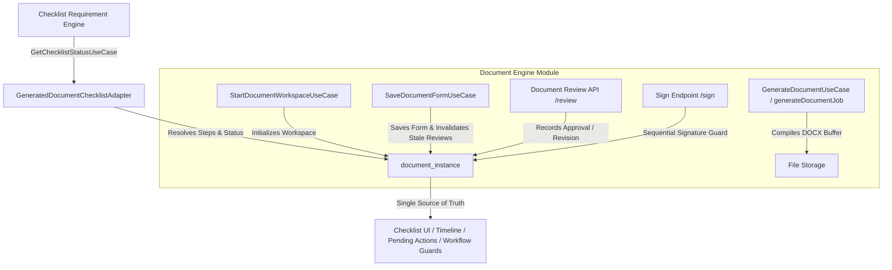

# Document Engine (Workspace) Documentation

The Document Engine is a Clean Architecture module responsible for managing the complete statutory document lifecycle (**`GENERATE` $\rightarrow$ `ADDITIONAL_INFO` $\rightarrow$ `REVIEW` $\rightarrow$ `SIGN` $\rightarrow$ `COMPLETED`**), dynamic forms, document review/vetting, permission-driven sequential signatures, and dual-format document streaming. It relies on the pure core engine (`src/lib/engines/docx`) for actual zip and XML manipulation.

---

## Core Architecture



- **Core Engine (`src/lib/engines/docx`)**: Pure, stateless `.docx` generation logic with `nullGetter()` protection.
- **Application Layer (`src/modules/document-engine/application/use-cases`)**: Clean Use Cases (`StartDocumentWorkspaceUseCase`, `GenerateDocumentUseCase`, `SaveDocumentDocumentUseCase`).
- **API Layer (`src/app/api/document-engine`)**: Secure REST API endpoints orchestrating Use Cases (`/workspace`, `/generate`, `/sign`, `/save-form`, `/review`).
- **Shared UI (`src/shared/components/coalrr/DocumentWorkspaceModal.tsx`)**: Reusable platform UI workspace with dynamic forms, document review history card, auto-collapsible panels, sequential signature workflows, and dual format downloads.
- **File Management & HTML Preview (`FilePreview.tsx`)**: Renders `.docx` documents instantly in-browser using `mammoth.convertToHtml()`.

---

## Complete Document Requirement Lifecycle

The Document Engine integrates directly with the **Checklist Requirement Engine** via [`GeneratedDocumentChecklistAdapter.ts`](file:///d:/coalrrnextjs/src/core/checklist/services/GeneratedDocumentChecklistAdapter.ts). Every statutory document requirement resolves a step sequence configured in `checklist_requirement_rule.input_schema.completion_steps`.

### 1. Configured Lifecycle Steps

| Step | Action Required | Evidence Collected | Permission Required |
| :--- | :--- | :--- | :--- |
| **`GENERATE`** | Initial document compilation from domain placeholders | `instance.generated_docx_path` is not null | `<template>.generate` / `document.generate` |
| **`ADDITIONAL_INFO`** | Submitting user input fields in dynamic form | `instance.form_data` is saved & non-empty | `<template>.additional_info` / `document.edit` |
| **`REVIEW`** | Reviewing content and recording vetting decision | Entry in `instance.review_data_json` with `decision === 'APPROVED'` | `<template>.review` / `document.review` / `workflow.approve` |
| **`SIGN`** | Applying sequential role signatures | `instance.signature_data_json` contains all required signatures | `document_template_signature.sig_permission` |

### 2. Step Status Resolution & Action Guidance

The adapter computes individual step progress (`stepDetails`) and next action (`nextAction`):
- **`COMPLETED`**: Evidence exists for the step.
- **`PENDING`**: Step is active and ready for current user action.
- **`LOCKED`**: Step is waiting for a prior required step (e.g. signature waiting for review approval).

```json
{
  "status": "in_progress",
  "generatedDocInfo": {
    "instanceId": "doc-inst-123",
    "templateCode": "FORM_VII",
    "status": "DRAFT",
    "stepDetails": [
      { "type": "GENERATE", "status": "COMPLETED", "label": "Generate Document" },
      { "type": "ADDITIONAL_INFO", "status": "COMPLETED", "label": "Fill Additional Info" },
      { "type": "REVIEW", "status": "PENDING", "permission": "form_vii.review", "label": "Review & Approve" },
      { "type": "SIGN", "status": "LOCKED", "label": "Apply Signatures" }
    ],
    "nextAction": {
      "type": "REVIEW",
      "permission": "form_vii.review",
      "label": "Review & Approve",
      "canCurrentUserAct": true
    }
  }
}
```

---

## Document Review & Vetting Engine

### 1. Database Schema (`document_instance.review_data_json`)
Document reviews are stored in the JSONB column `review_data_json`:
```json
[
  {
    "decision": "APPROVED",
    "comment": "Verified land schedule boundaries against mining lease map.",
    "reviewerId": "usr-456",
    "reviewerName": "Senior Land Officer",
    "permission": "form_vii.review",
    "timestamp": "2026-08-14T12:00:00.000Z"
  }
]
```

### 2. Review Endpoint (`POST /api/document-engine/review`)
- **Payload**: `{ instanceId: string, decision: 'APPROVED' | 'REVISION_REQUESTED', comment?: string }`
- **Server-Side Authorization**: Requires permission `<template_code_lowercase>.review` or `document.review` or `workflow.approve` or `*` or an authorized role (`admin`, `super`, `officer`).
- **Audit & Outbox Events**: Emits `DOCUMENT_REVIEWED` / `DOCUMENT_REVISION_REQUESTED` events to `outbox_events` and logs activity via `Audit.logCustomAction`.

---

## Content Modification & Version Invalidation

When form data is modified via `POST /api/document-engine/save-form` after document reviews have been recorded:
1. The server compares `instance.form_data` against the newly submitted data.
2. If content changed, existing review entries are marked `decision = 'INVALIDATED_DUE_TO_CONTENT_CHANGE'`.
3. The requirement status automatically transitions back to **`IN_PROGRESS`**, requiring the reviewer to re-inspect and re-approve the updated document.

---

## Permission-Driven & Sequential Signature Architecture

### 1. `sig_permission` Column Mapping
`document_template_signature.sig_permission` stores explicit permission strings:
```
<template_code_lowercase>.sign.<role_code_lowercase>
```

#### Examples:
- **Form XXII**:
  - `form_xxii.sign.area_land_cell_member` (Step 1)
  - `form_xxii.sign.area_land_officer` (Step 2)
  - `form_xxii.sign.area_gm` (Step 3)
- **Form VII**:
  - `form_vii.sign.acq_land_clerk` (Step 1)
  - `form_vii.sign.acq_surveyor` (Step 2)
  - `form_vii.sign.acq_project_manager` (Step 3)
  - `form_vii.sign.acq_land_officer` (Step 4)
  - `form_vii.sign.acq_agm` (Step 5)

### 2. Server-Side Sequential & Authorization Guards (`POST /api/document-engine/sign`)
- **Permission Check**: Verifies that `auth.user.permissions` contains the exact `sig_permission` or `document.sign` / `*`.
- **Sequential Guard**: Rejects signature attempt if preceding required steps in `resolver_signatures_json` are unsigned:
  > *"Sequential error: Step 1 (form_xxii.sign.area_land_cell_member) must be signed before step 2."*

---

## Dual Format Streaming & Security Guards

Documents generated by the engine can be retrieved in two formats via `GET /api/files/[fileId]/download`:

### 1. Watermarked PDF Download (`format=pdf` or `preview=true`)
- Available to authorized project viewers.
- Dynamically applies QR code verification stamp, downloader user details, and timestamp.

### 2. Editable Raw `.docx` Download (`!forcePdf && !isPreview`)
- **API-Level Security Guard**: Enforces server-side authorization check.
  - Requires permission `document.download_docx`, `document.edit`, `document.generate`, `*`, or an authorized role (`admin`, `super`, `officer`, `cell`).
  - Returns HTTP **`403 Forbidden`** if unauthorized.
- **UI-Level Security Guard**: The `[ Download DOCX ]` button renders in [`DocumentWorkspaceModal.tsx`](file:///d:/coalrrnextjs/src/shared/components/coalrr/DocumentWorkspaceModal.tsx) strictly when `canDownloadDocx === true`.

---

## How to Register a New Form Template (Step-by-Step)

### Step 1: Create the `.docx` Template
Create a Microsoft Word document. Place variables inside single curly braces `{}`.

### Step 2: Store the File
Place file in `src/lib/engines/docx/templates/FormXXIV_Template.docx`.

### Step 3: Database Registry (`document_template`)
```sql
INSERT INTO document_template (id, template_code, template_name, storage_path)
VALUES (gen_random_uuid(), 'FORM-XXIV', 'Land Acquisition Notice', 'FormXXIV_Template.docx');
```

### Step 4: Configure Dynamic Form Fields (`document_template_field`)
```sql
INSERT INTO document_template_field (id, template_code, field_key, label, field_type, is_required, display_order)
VALUES 
(gen_random_uuid(), 'FORM-XXIV', 'NoticeDate', 'Notice Date', 'date', true, 1);
```

### Step 5: Configure Permission Signature Routing (`document_template_signature`)
```sql
INSERT INTO document_template_signature 
  (id, template_code, sig_permission, workflow_state, placeholders, is_required, display_order)
VALUES 
  (gen_random_uuid(), 'FORM-XXIV', 'form_xxiv.sign.land_cell_member', 'AreaVetted', '{"name":"LandCell_Name","date":"LandCell_Date"}'::jsonb, true, 1),
  (gen_random_uuid(), 'FORM-XXIV', 'form_xxiv.sign.land_officer', 'AreaVetted', '{"name":"LandOfficer_Name","date":"LandOfficer_Date"}'::jsonb, true, 2);
```

---

## API Endpoints Reference

| Route | Method | Access Guard / Permission | Description |
| :--- | :--- | :--- | :--- |
| `/api/document-engine/workspace` | `POST` | `project.view` | Initializes workspace draft, returns fields, signatures, review data, and user permissions |
| `/api/document-engine/generate` | `POST` | `document.generate` / `project.view` | Resolves fields, applies signatures, compiles `.docx` buffer |
| `/api/document-engine/save-form` | `POST` | `document.edit` / `project.view` | Saves dynamic form fields; invalidates stale reviews on content change |
| `/api/document-engine/review` | `POST` | `template_code.review` / `document.review` | Records `APPROVED` or `REVISION_REQUESTED` decision in `review_data_json` |
| `/api/document-engine/sign` | `POST` | `document_template_signature.sig_permission` | Validates sequential step order & applies digital signature entry |
| `/api/files/[fileId]/download?format=pdf` | `GET` | `project.view` | Streams watermarked PDF with verification QR code |
| `/api/files/[fileId]/download` | `GET` | `document.download_docx` / `document.edit` | Streams raw editable `.docx` file (enforces HTTP 403 when unauthorized) |
