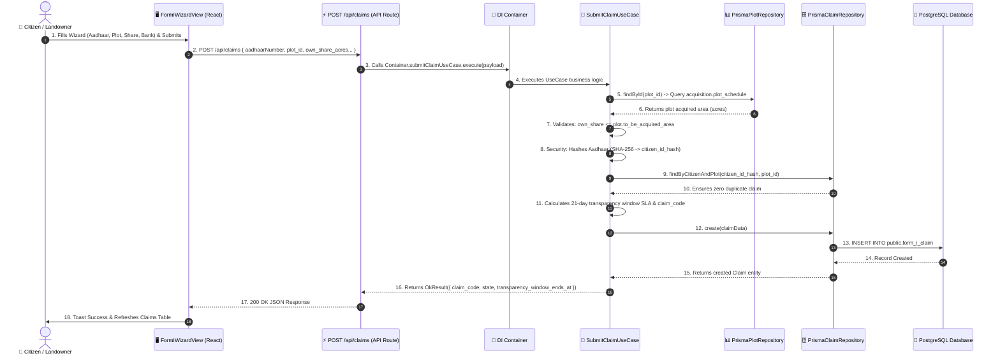

# Form-I Citizen Claim Submission — End-to-End Workflow Documentation

This document provides a comprehensive starting-to-ending technical summary of how the **Form-I Citizen Claim Submission Wizard** operates across all layers of the application (Frontend UI, API Routes, Dependency Injection, Application UseCases, Repositories, and Database Persistence).

---

## 🏗️ Architecture & Sequence Overview



---

## 🔍 Detailed Component & Layer Mapping

### 1. 🖥️ Frontend (UI Layer)
- **Page Component**: [`src/app/(dashboard)/claims/page.tsx`](file:///d:/COALRR/coalrrnextjs/src/app/(dashboard)/claims/page.tsx)
  - Next.js App Router dashboard route.
  - Fetches existing claims (`GET /api/claims`) and available plot schedules (`GET /api/plots`).
  - Renders [`FormIWizardView`](file:///d:/COALRR/coalrrnextjs/src/shared/components/coalrr/views/FormIWizardView.tsx).

- **Wizard Component**: [`FormIWizardView.tsx`](file:///d:/COALRR/coalrrnextjs/src/shared/components/coalrr/views/FormIWizardView.tsx)
  - Wraps [`WizardShell`](file:///d:/COALRR/coalrrnextjs/src/shared/components/coalrr/WizardShell.tsx) with a 5-step user journey:
    1. **Identity Step**: Aadhaar 12-digit input ➔ Mobile OTP verification simulation.
    2. **Plot Selection Step**: Selects plot schedule loaded from `acquisition.plot_schedule`.
    3. **Share & Bank Step**: Input land share in acres (`own_share_acres`), opt monetary compensation switch (`opted_monetary_in_lieu_of_employment`), and RTGS Bank details.
    4. **Documents Step**: Uploads First-Class Magistrate Affidavit, Parcha/Title deeds, and Bank passbook via [`DocumentUploader`](file:///d:/COALRR/coalrrnextjs/src/shared/components/coalrr/DocumentUploader.tsx).
    5. **Review & Submit Step**: Summary review ➔ Triggers `POST /api/claims`.

---

### 2. ⚡ Backend API Route Layer
- **Route File**: [`src/app/api/claims/route.ts`](file:///d:/COALRR/coalrrnextjs/src/app/api/claims/route.ts)
- **POST Handler**:
  - Parses JSON request body.
  - Delegates execution to the Clean Architecture Dependency Injection container:
    ```ts
    const result = await Container.submitClaimUseCase.execute(body)
    ```
  - Returns `200 OK` on success or `400/500 Error` on validation failure.

---

### 3. 🔌 Dependency Injection Layer
- **DI Module**: [`src/infrastructure/di/modules/land.di.ts`](file:///d:/COALRR/coalrrnextjs/src/infrastructure/di/modules/land.di.ts)
  - Instantiates persistence repositories (`PrismaClaimRepository`, `PrismaPlotRepository`).
  - Injects repositories into `SubmitClaimUseCase`.
  - Registered globally in [`Container.ts`](file:///d:/COALRR/coalrrnextjs/src/infrastructure/di/Container.ts) under `Container.submitClaimUseCase`.

---

### 4. 🧠 Application UseCase (Business Rules)
- **File**: [`src/application/use-cases/land-acquisition/claims/SubmitClaimUseCase.ts`](file:///d:/COALRR/coalrrnextjs/src/application/use-cases/land-acquisition/claims/SubmitClaimUseCase.ts)
- **Business Validations Executed**:
  1. **Mandatory Input Check**: Validates `aadhaarNumber`, `claimant_name`, `plot_id`, `own_share_acres`.
  2. **Plot Schedule Verification**: Queries `IPlotRepository.findById(plot_id)` against `acquisition.plot_schedule`. Rejects if plot is not in approved notification schedule.
  3. **Plot Capacity Check**: Validates `own_share_acres > 0` AND `own_share_acres <= plot.to_be_acquired_area`. Prevents over-claiming plot acreage.
  4. **Identity Hashing (Privacy & Security)**: Computes SHA-256 hash of 12-digit Aadhaar number (`citizen_id_hash = SHA256(aadhaarNumber)`). Plaintext Aadhaar is never persisted.
  5. **Duplicate Prevention**: Checks `IClaimRepository.findByCitizenAndPlot(citizen_id_hash, plot_id)`. Rejects duplicate claim submissions by the same citizen on the same plot.
  6. **SLA & State Generation**:
     - Formats unique `claim_code` (`FORM1-YYYY-XXXX`).
     - Sets `state = 'TitleScrutiny'`.
     - Calculates 21-day statutory transparency window SLA (`submitted_at + 21 days`).

---

### 5. 🗄️ Database & Persistence Layer
- **Repository Implementation**: [`src/infrastructure/persistence/repositories/PrismaClaimRepository.ts`](file:///d:/COALRR/coalrrnextjs/src/infrastructure/persistence/repositories/PrismaClaimRepository.ts)
- **Prisma Model**: `model form_i_claim` in [`prisma/schema.prisma`](file:///d:/COALRR/coalrrnextjs/prisma/schema.prisma)
- **PostgreSQL Table**: `public.form_i_claim`
- **Stored Fields**:
  - `id` (UUID Primary Key)
  - `claim_code` (String, e.g. `FORM1-2026-8493`)
  - `plot_id` (BigInt FK ➔ `acquisition.plot_schedule`)
  - `citizen_id_hash` (SHA-256 String)
  - `claimant_name` (String)
  - `own_share_acres` (Decimal 10,4)
  - `opted_monetary_in_lieu_of_employment` (Boolean)
  - `bank_account_number` (String)
  - `bank_ifsc` (String)
  - `state` (Default `'TitleScrutiny'`)
  - `submitted_at` (Timestamp)
  - `transparency_window_ends_at` (Timestamp, 21 days from submit)

---

## 📊 End-to-End File Map

| Layer | File Path | Role |
| :--- | :--- | :--- |
| **UI Page** | [`src/app/(dashboard)/claims/page.tsx`](file:///d:/COALRR/coalrrnextjs/src/app/(dashboard)/claims/page.tsx) | Page route rendering claims view |
| **UI View** | [`src/shared/components/coalrr/views/FormIWizardView.tsx`](file:///d:/COALRR/coalrrnextjs/src/shared/components/coalrr/views/FormIWizardView.tsx) | Multi-step Form-I wizard component |
| **API Route** | [`src/app/api/claims/route.ts`](file:///d:/COALRR/coalrrnextjs/src/app/api/claims/route.ts) | HTTP POST handler |
| **DI Container** | [`src/infrastructure/di/Container.ts`](file:///d:/COALRR/coalrrnextjs/src/infrastructure/di/Container.ts) | Dependency injection registry |
| **Use Case** | [`src/application/use-cases/land-acquisition/claims/SubmitClaimUseCase.ts`](file:///d:/COALRR/coalrrnextjs/src/application/use-cases/land-acquisition/claims/SubmitClaimUseCase.ts) | Application business logic |
| **Claim Repository** | [`src/infrastructure/persistence/repositories/PrismaClaimRepository.ts`](file:///d:/COALRR/coalrrnextjs/src/infrastructure/persistence/repositories/PrismaClaimRepository.ts) | Database operations on `form_i_claim` |
| **Plot Repository** | [`src/infrastructure/persistence/repositories/PrismaPlotRepository.ts`](file:///d:/COALRR/coalrrnextjs/src/infrastructure/persistence/repositories/PrismaPlotRepository.ts) | Database operations on `acquisition.plot_schedule` |
| **Schema** | [`prisma/schema.prisma`](file:///d:/COALRR/coalrrnextjs/prisma/schema.prisma) | Prisma ORM database models |
