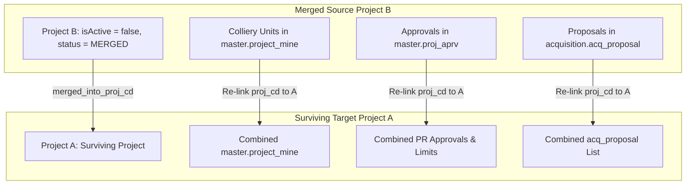

# Project Merging Feature — Architectural Implementation Plan

This document outlines the detailed technical design and implementation blueprint for merging two CIL colliery projects (**Source Project** $\rightarrow$ **Target Project**) in the future.

---

## 1. Executive Summary & Business Rationale

In Coal India Limited (CIL) operations, adjacent mining projects or sequential project phases (e.g. *Bhubaneswari OCP Phase I* and *Bhubaneswari OCP Phase II*) are occasionally merged into a single expanded project by CIL Board sanction. 

When Project B is merged into Target Project A:
1. **Target Project A (Surviving Project)** inherits all colliery units, land area baselines, financial budgets, statutory approvals, proposals, and plot schedules from Project B.
2. **Source Project B (Merged Project)** is deactivated (`isActive = false`) and marked as `status = MERGED`, storing `merged_into_proj_cd = 'PROJ_A'` to preserve a 100% auditable historical record.

---

## 2. Database Schema & Relational Blueprint

### A. Schema Enhancements (`master.project`)

To support project merging with full auditability, the following columns will be added to `master.project`:

```sql
-- Migration Script: Future Project Merging Support
ALTER TABLE master.project 
ADD COLUMN IF NOT EXISTS merged_into_proj_cd VARCHAR(30),
ADD COLUMN IF NOT EXISTS merged_at TIMESTAMP WITH TIME ZONE,
ADD COLUMN IF NOT EXISTS merge_remarks TEXT;

ALTER TABLE master.project
ADD CONSTRAINT fk_project_merged_into 
FOREIGN KEY (merged_into_proj_cd) REFERENCES master.project(proj_cd) 
ON UPDATE CASCADE ON DELETE SET NULL;
```

### B. Relational Data Flow During Merge



| Entity Table | Action During Merge Transaction | Relational Impact |
| :--- | :--- | :--- |
| **`master.project` (Target)** | `is_combo_project = true`, land & R&R budget ceilings summed | Target project automatically handles multi-mine operations. |
| **`master.project` (Source)** | `isActive = false`, `status = MERGED`, `merged_into_proj_cd = Target.projCd` | Source project becomes read-only with a direct link to Target. |
| **`master.project_mine`** | Re-link `proj_cd` from Source to Target (`is_primary = false`) | All colliery units are merged under Target project's ownership. |
| **`master.proj_aprv`** | Re-link `proj_cd` from Source to Target | Baseline land limits (Tenancy, Govt, Forest) are combined under Target. |
| **`master.proj_aprv_location`** | Unchanged (`aprv_cd` FK is maintained) | Civil revenue mouza allocations automatically move with the approvals. |
| **`acquisition.acq_proposal`** | Re-link `proj_cd` from Source to Target | All proposals move under Target project while retaining original proposal numbers. |
| **`acquisition.plot_schedule`** | Unchanged (`proposal_id` FK is maintained) | All plot schedules remain 100% valid and linked. |

---

## 3. Application Layer Design (`MergeProjectsUseCase.ts`)

The project merge feature will be encapsulated in a Clean Architecture Use Case operating within an isolated atomic database transaction (`db.$transaction`):

```typescript
// Proposed Location: src/application/use-cases/project/MergeProjectsUseCase.ts

export interface MergeProjectsRequest {
  sourceProjCd: string
  targetProjCd: string
  mergeRemarks: string
  executedByUserId: string
}

export class MergeProjectsUseCase {
  constructor(
    private readonly projectRepo: IProjectRepository,
    private readonly auditService: IAuditService
  ) {}

  async execute(request: MergeProjectsRequest): Promise<Result<void, DomainError>> {
    // 1. Validation: Ensure source and target exist, are distinct, and source is not already merged
    if (request.sourceProjCd === request.targetProjCd) {
      return Result.fail('Source and Target projects cannot be the same.')
    }

    // 2. Perform Atomic Database Transaction
    await db.$transaction(async (tx) => {
      // a. Re-link project_mine colliery entries
      await tx.project_mine.updateMany({
        where: { proj_cd: request.sourceProjCd },
        data: { proj_cd: request.targetProjCd, is_primary: false }
      })

      // b. Re-link proj_aprv baseline approvals
      await tx.projAprv.updateMany({
        where: { projCd: request.sourceProjCd },
        data: { projCd: request.targetProjCd }
      })

      // c. Re-link land acquisition proposals
      await tx.acq_proposal.updateMany({
        where: { proj_cd: request.sourceProjCd },
        data: { proj_cd: request.targetProjCd }
      })

      // d. Mark Target project as combo project
      await tx.project.update({
        where: { projCd: request.targetProjCd },
        data: { is_combo_project: true }
      })

      // e. Deactivate Source project and record merge trail
      await tx.project.update({
        where: { projCd: request.sourceProjCd },
        data: {
          isActive: false,
          merged_into_proj_cd: request.targetProjCd,
          merged_at: new Date(),
          merge_remarks: request.mergeRemarks,
          updtBy: request.executedByUserId,
          updtTs: BigInt(Math.floor(Date.now() / 1000))
        }
      })
    })

    // 3. Log Audit Entry
    await this.auditService.log({
      action: 'PROJECT_MERGE',
      entityId: request.targetProjCd,
      actorId: request.executedByUserId,
      payload: { source: request.sourceProjCd, target: request.targetProjCd, remarks: request.mergeRemarks }
    })

    return Result.ok()
  }
}
```

---

## 4. UI/UX Component Specifications (`MergeProjectsDialog.tsx`)

### Proposed Location
`src/modules/project-master/components/MergeProjectsDialog.tsx`

### Interface Controls
1. **Source Project Picker** (`<ProjectSelect />`): Select the project to be merged and deactivated.
2. **Target Project Picker** (`<ProjectSelect excludeValues={[sourceProjCd]} />`): Select the surviving project.
3. **Merge Impact Preview**:
   - Combined Approved Land Area (Acres)
   - Combined Land & R&R Budgets (INR)
   - Total Proposals to be Transferred
   - List of Colliery Units to be Linked
4. **Sanction Remarks & Confirmation**: Mandatory text area for Board Sanction reference number and approval justification.

---

## 5. Verification & Checklist for Future Implementation

- [ ] Execute `ALTER TABLE master.project` script to add audit columns.
- [ ] Run `npx prisma db pull && npx prisma generate` to sync Prisma models.
- [ ] Create `MergeProjectsUseCase.ts` under application use-cases.
- [ ] Add `POST /api/projects/[id]/merge` API route protected by `project.edit` permission.
- [ ] Build `<MergeProjectsDialog />` UI modal in Project Master module.
- [ ] Run `npx tsc --noEmit` to confirm zero compilation errors.
