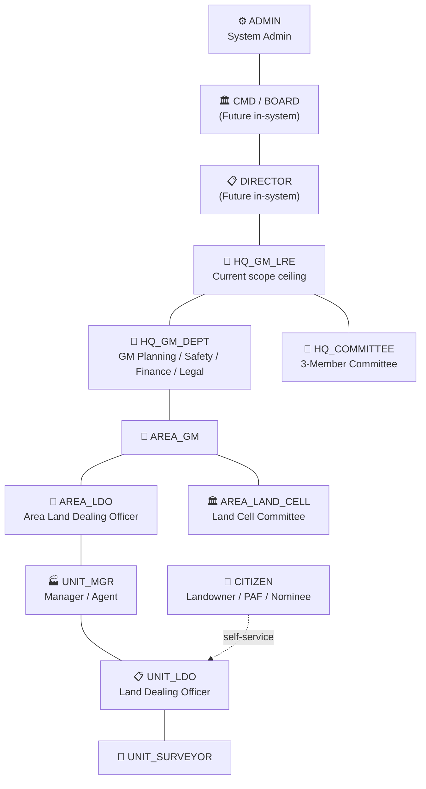
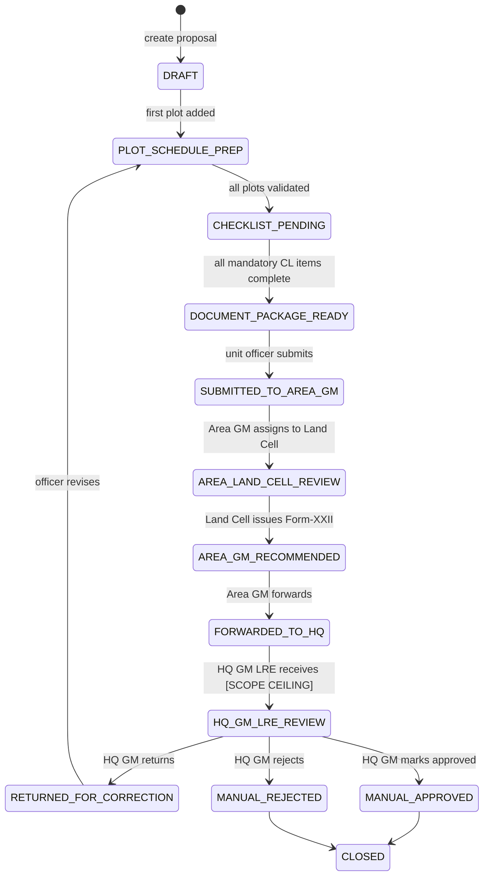

# Technical Design Document (TDD)
## COALRR — ECL Land Department Digital Workflow Platform
**Version**: 1.0 | **Date**: 2026-08-03 | **Classification**: Internal — Architecture

---

## Table of Contents
1. [Executive Summary](#1-executive-summary)
2. [SOP & DB Gap Analysis](#2-sop--db-gap-analysis)
3. [System Architecture Diagram](#3-system-architecture-diagram)
4. [Actor & Role Model](#4-actor--role-model)
5. [Service Layer Definition](#5-service-layer-definition)
6. [Module Roadmap — Development Phases](#6-module-roadmap--development-phases)
7. [Scalability & Department-Agnostic Strategy](#7-scalability--department-agnostic-strategy)
8. [Database Additions Required](#8-database-additions-required)
9. [API Design Conventions](#9-api-design-conventions)
10. [Compliance Mapping (AGENTS.md)](#10-compliance-mapping-agentsmd)

---

## 1. Executive Summary

COALRR is the ECL (Eastern Coalfields Limited) Land Department digital workflow platform. It automates the proposal preparation, checklist compliance, document generation, and milestone tracking lifecycle for five land acquisition process types:

| Code | Process |
|------|---------|
| PF-1 | CBA (A&D) Act, 1957 — Acquisition |
| PF-2 | Direct Purchase via Sale Deed Registration |
| PF-3 | Government / Patta Land Transfer |
| PF-4 | Rehabilitation Package Approval (PAF) |
| PF-5 | RFCTLARR Act, 2013 Acquisition |

**Current approval chain scope (in-system)**: `Public Citizen → Unit Office → HQ GM LRE`

All levels above HQ GM LRE (Directors, CMD, ECL Board) are tracked as **manual milestones** — system-generated requirement documentation with status tracking, but no system-to-system integration required at this stage.

The system is designed with a **department-agnostic workflow engine** so new departments (GM Finance, GM Planning, Director Technical, CMD, ECL Board) can be inserted into the approval chain via DB configuration — without code refactoring.

---

## 2. SOP & DB Gap Analysis

### 2.1 SOP-Identified Actors vs System Role Model

| Actor | System Role | Level | Current DB Support |
|-------|------------|-------|-------------------|
| Surveyor / RI / Amin | `UNIT_SURVEYOR` | Unit | `area_cd` scoping — ✅ partial |
| Land Dealing Official | `UNIT_LDO` | Unit | `area_cd` scoping — ✅ partial |
| Safety Officer | `UNIT_SAFETY` | Unit | Not modelled — ❌ Gap |
| Manager / Agent / Project Officer | `UNIT_MGR` | Unit | Not modelled — ❌ Gap |
| Area Land Cell Committee Member | `AREA_LAND_CELL` | Area | `just_fwd` forwarding — ✅ partial |
| Area Land Dealing Officer | `AREA_LDO` | Area | Not modelled — ❌ Gap |
| Area Finance Manager | `AREA_FINANCE` | Area | Not modelled — ❌ Gap |
| Area General Manager | `AREA_GM` | Area | `aprv_stat`/`aprv_by` — ✅ partial |
| GM (LRE), HQ | `HQ_GM_LRE` | HQ | No dedicated role/scope table — ❌ Gap |
| GM (Planning), GM (Safety), GM (Finance) | `HQ_DEPT_GM` | HQ | Not modelled — ❌ Gap |
| 3-Member Committee (LRE+Legal+Planning) | `HQ_COMMITTEE` | HQ | Not modelled — ❌ Gap |
| Functional Directors | `DIRECTOR` | Board | Not modelled — ❌ Gap |
| CMD, ECL | `CMD` | Board | Not modelled — ❌ Gap |
| ECL Board | `BOARD` | Board | Not modelled — ❌ Gap |
| Empanelled Lawyer | `EXT_LAWYER` | External | Not modelled — ❌ Gap |
| Landowner / Person Interested | `CITIZEN` | Public | `ownr_list`, `beneficiary_master` — ✅ |
| Nominee (for employment) | `CITIZEN_NOMINEE` | Public | `beneficiary_master` — ✅ |
| PAF (Project Affected Family) | `CITIZEN_PAF` | Public | Not separate — ❌ Gap |

### 2.2 SOP-Identified Forms vs Database Coverage

| SOP Form | Purpose | DB Coverage | Gap |
|----------|---------|------------|-----|
| Form-I | Landowner claim application | `ownr_list` + `beneficiary_master` | ✅ Structural |
| Form-II | Compiled land schedule (with abstract) | `plot_det` derived | ✅ Partial |
| Form-III | Abstract published on ECL website | Generated from `plot_det` | ✅ Partial |
| Form-IV | Possession document | `acq_poss` | ✅ |
| Form-V | Nominee bio-data | `employment` module | ✅ Partial |
| Form-VI | Self-declaration certificate | No dedicated table | ❌ Gap |
| Form-VII | Reconciliation Certificate (adjacent mines) | `mut_det` ref only | ❌ Unstructured |
| Form-VIII | Land Utilisation Certificate | No dedicated table | ❌ Gap |
| Form-IX | Unit Authority statement | No dedicated table | ❌ Gap |
| Form-X | Unit Authority statement | No dedicated table | ❌ Gap |
| Form-XI | Composite employment summary | `employment` partial | ❌ Gap |
| Form-XII | Employment gist | `employment` partial | ❌ Gap |
| Form-XIII | 18-point document verification | No dedicated table | ❌ Gap |
| Form-XIV | Employment synopsis for website | No dedicated table | ❌ Gap |
| Form-XV, XVA | Police/on-spot verification | No dedicated table | ❌ Gap |
| Form-XVI | Five-Point Certificate | No structured table | ❌ Gap |
| Form-XIX | Patta Holder Affidavit | No table | ❌ Gap |
| Form-XX | Patta Agreement | No table | ❌ Gap |
| Form-XXI | Area Land Dealing Officer certificate | No dedicated table | ❌ Gap |
| Form-XXII | Area Land Cell Committee Report | No structured table | ❌ Gap |
| Form-XXIII | Female nominee justification | No dedicated table | ❌ Gap |
| Form-XXIV | Section 14(1) Agreement + Affidavit | No table | ❌ Gap |
| Form-A | Employment application | `employment` module | ✅ Partial |
| Form-D | Compensation & R&R Register | `beneficiary_list` flags | ✅ Partial |
| Form-1A | Compensation payroll (detail) | `compensation` module | ✅ Partial |
| Form-1B | Compensation payroll (abstract) | `compensation` module | ✅ Partial |
| CL-1 through CL-6 | SOP Checklists (138 items) | `chk_det` JSONB structure | ❌ Items not seeded |

### 2.3 Process-Level Functional Gaps

| # | Gap Area | Detail | Priority |
|---|----------|--------|----------|
| 1 | **Workflow Engine** | `just_fwd` is a forwarding log, not a configurable state machine | 🔴 HIGH |
| 2 | **Manual Milestone Tracking** | CMD/Board approval, Gazette publication, Tribunal deposit untracked | 🔴 HIGH |
| 3 | **Public Citizen Portal** | No self-service Form-I; no acknowledgement; no status tracker | 🔴 HIGH |
| 4 | **Checklist Engine Seeding** | `chk_det` table exists; 138 items not seeded | 🔴 HIGH |
| 5 | **Org-Scope Authorization** | No unified service; loose `area_cd` strings per table | 🔴 HIGH |
| 6 | **Project Limit Enforcement** | No service validates area/budget/employment vs project caps | 🟠 MEDIUM |
| 7 | **Deadline Tracking** | 3-week publication, 2-week complaint disposal, 2-year CBA window — untracked | 🟠 MEDIUM |
| 8 | **Notification System** | No outbox-driven notifications to officers / citizens on state changes | 🟠 MEDIUM |
| 9 | **Document Package Builder** | `document_instance` exists; no orchestrated proposal package generator | 🟠 MEDIUM |
| 10 | **Form-D Register Auto-population** | Compensation & R&R Register not auto-updated from disbursement records | 🟠 MEDIUM |
| 11 | **Website Publication Tracking** | ECL website publication for Form-III / Form-XIV not tracked in system | 🟠 MEDIUM |
| 12 | **Blockchain Integration** | `acq_prop_blockchain` table present but not wired to workflow | 🟡 LOW |
| 13 | **GIS / Mouza Map Layer** | SOP requires colour-washed mouza plans; no GIS integration | 🟡 LOW |

### 2.4 Existing DB Schema — Schema Coverage Map

| Schema | Tables Identified | Status |
|--------|------------------|--------|
| `acquisition` | `acq_prop`, `acq_prop_cba`, `acq_prop_dp`, `acq_prop_rfctlarr`, `plot_det`, `phase_det`, `acq_det`, `acq_poss`, `khtn_det`, `khtn_list`, `ownr_list`, `beneficiary_master`, `beneficiary_list`, `mut_det`, `reg_det`, `chk_det`, `just_fwd`, `poss_prop`, `owner_land_share`, `acq_prop_blockchain`, `clubd_proj_det`, `opt_plot_details`, `plot_sch_list_acq`, `proj_aprv`, `proj_det`, `possr_list` | Core present; needs enrichment |
| `master` / `public` | `checklist_requirement_rule`, `checklist_submission`, `workflow_transitions`, `workflow_review_task`, `document_template`, `document_instance`, `outbox_events`, `user_org_scope` | Present; needs seeding + activation |
| `audit` | `activity_log`, `application_log` | ✅ Present |
| `employment` | Employment proposal tables | ✅ Partial |
| `compensation` / `rnr-payrolls` | Payroll tables | ✅ Partial |

---

## 3. System Architecture Diagram

```mermaid
graph TB
    subgraph PUBLIC_INTERNET["🌐 Public Internet"]
        CITIZEN["👤 Public Citizen\n(Land Owner / PAF / Nominee)"]
    end

    subgraph UNIT_OFFICE["🏭 Unit Office — Mine / Colliery"]
        UNIT_LDO["📋 Unit Land Dealing Officer\n+ Surveyor + Manager"]
        AREA_LC["🏛️ Area Land Cell Committee"]
        AREA_GM["👔 Area General Manager"]
    end

    subgraph HQ_SCOPE["🏢 HQ — GM LRE ← Current In-System Scope Ceiling"]
        HQ_GM_LRE["🎯 GM LRE, HQ\n[SCOPE CEILING]"]
    end

    subgraph MANUAL_MILESTONES["📌 Manual Milestone Zone\n(System tracks; not digitally integrated)"]
        HQ_PLANNING["GM Planning"]
        HQ_SAFETY["GM Safety"]
        HQ_FINANCE["GM Finance"]
        HQ_LEGAL["HOD Legal"]
        DIR_TECH["Director Technical"]
        CMD["CMD, ECL"]
        BOARD["ECL Board"]
        MoC["Ministry of Coal\n(Gazette Notifications)"]
        DISTRICT["District Authority\n(Collector / SDO)"]
    end

    subgraph COALRR["⚙️ COALRR Platform — Next.js"]

        subgraph PORTALS["Presentation Layer — Next.js App Router"]
            CP["🌐 Citizen Portal\n/citizen/*"]
            UP["🖥️ Unit Portal\n/unit/*"]
            HP["🏢 HQ Portal\n/hq/*"]
            AP["⚙️ Admin Portal\n/admin/*"]
        end

        subgraph USECASES["Application Layer — Use Cases"]
            UC_CLAIM["ClaimUseCase"]
            UC_PROJ["ProjectUseCase"]
            UC_PROP["ProposalUseCase"]
            UC_PLOT["PlotScheduleUseCase"]
            UC_CL["ChecklistUseCase"]
            UC_DOC["DocumentPackageUseCase"]
            UC_MILE["MilestoneUseCase"]
            UC_WF["WorkflowTransitionUseCase"]
            UC_EMP["EmploymentUseCase"]
        end

        subgraph SERVICES["Core Service Layer — src/core/"]
            WF_SVC["WorkflowService\nStrategy Pattern\nDB-configured transitions"]
            LIMIT_SVC["ProjectLimitService\nArea/Budget/Employment caps"]
            CL_SVC["ChecklistService\nCL-1 to CL-6\n138 items"]
            DOC_SVC["DocumentPackageService\n20+ SOP forms"]
            MILE_SVC["ManualMilestoneService\n14 milestone types"]
            NOTIFY_SVC["NotificationService\nOutbox Pattern"]
            AUDIT_SVC["AuditService\nexisting audit.activity_log"]
            AUTH_SVC["OrgScopeAuthorizationService\nuser_org_scope"]
            DL_SVC["DeadlineTrackerService\nSOP deadlines"]
        end

        subgraph REPOS["Repository Layer — Prisma ORM"]
            PROJ_REPO["ProjectRepository"]
            PROP_REPO["ProposalRepository"]
            PLOT_REPO["PlotScheduleRepository"]
            CHK_REPO["ChecklistRepository"]
            MILE_REPO["MilestoneRepository"]
            OWNER_REPO["OwnerRepository"]
            WF_REPO["WorkflowRepository"]
            EMP_REPO["EmploymentRepository"]
            DOC_REPO["DocumentRepository"]
        end

        subgraph INFRA["Infrastructure Layer"]
            DB["🗄️ PostgreSQL\ndisputedb"]
            FS["📁 File Storage\nMinIO / S3"]
            OUTBOX["📨 public.outbox_events\nTransactional Outbox"]
            JOB["⚙️ JobDispatcherService\nBullMQ (prod)\nImmediate (dev)"]
            BC["🔗 acq_prop_blockchain\nImmutability"]
        end
    end

    CITIZEN --> CP
    UNIT_LDO --> UP
    AREA_LC --> UP
    AREA_GM --> UP
    HQ_GM_LRE --> HP

    CP --> UC_CLAIM
    UP --> UC_PROJ
    UP --> UC_PROP
    UP --> UC_PLOT
    UP --> UC_CL
    UP --> UC_DOC
    UP --> UC_MILE
    UP --> UC_EMP
    HP --> UC_WF
    HP --> UC_MILE
    AP --> WF_SVC

    UC_CLAIM --> LIMIT_SVC
    UC_CLAIM --> CL_SVC
    UC_PROP --> WF_SVC
    UC_PROP --> LIMIT_SVC
    UC_PLOT --> LIMIT_SVC
    UC_CL --> CL_SVC
    UC_DOC --> DOC_SVC
    UC_MILE --> MILE_SVC
    UC_WF --> WF_SVC

    WF_SVC --> NOTIFY_SVC
    WF_SVC --> AUDIT_SVC
    WF_SVC --> DL_SVC
    WF_SVC --> BC
    WF_SVC --> WF_REPO

    LIMIT_SVC --> PROJ_REPO
    CL_SVC --> CHK_REPO
    MILE_SVC --> MILE_REPO
    DOC_SVC --> DOC_REPO
    DOC_SVC --> FS
    AUTH_SVC --> WF_REPO

    PROJ_REPO --> DB
    PROP_REPO --> DB
    PLOT_REPO --> DB
    CHK_REPO --> DB
    MILE_REPO --> DB
    WF_REPO --> DB
    OWNER_REPO --> DB
    EMP_REPO --> DB
    DOC_REPO --> DB

    NOTIFY_SVC --> OUTBOX
    OUTBOX --> JOB

    HQ_PLANNING -.->|"Manual milestone recorded"| MILE_SVC
    HQ_SAFETY -.->|"Manual milestone"| MILE_SVC
    HQ_FINANCE -.->|"Manual milestone"| MILE_SVC
    DIR_TECH -.->|"Manual milestone"| MILE_SVC
    CMD -.->|"Manual milestone"| MILE_SVC
    BOARD -.->|"Manual milestone"| MILE_SVC
    MoC -.->|"Gazette Notification milestone"| MILE_SVC
    DISTRICT -.->|"District Authority milestone"| MILE_SVC
```



---

## 4. Actor & Role Model

### 4.1 Role Hierarchy



### 4.2 Permission Matrix (Current In-System Scope)

| Action | CITIZEN | UNIT_LDO | UNIT_MGR | AREA_LAND_CELL | AREA_GM | HQ_GM_LRE |
|--------|:-------:|:--------:|:--------:|:--------------:|:-------:|:---------:|
| Submit Form-I Claim | ✅ | ❌ | ❌ | ❌ | ❌ | ❌ |
| View own claim status | ✅ | ❌ | ❌ | ❌ | ❌ | ❌ |
| Create Proposal Draft | ❌ | ✅ | ✅ | ❌ | ❌ | ❌ |
| Add / Edit Plot Schedule | ❌ | ✅ | ✅ | ❌ | ❌ | ❌ |
| Complete Checklist Items | ❌ | ✅ | ✅ | ✅ | ❌ | ❌ |
| Generate Document Package | ❌ | ✅ | ✅ | ❌ | ❌ | ❌ |
| Record Manual Milestones | ❌ | ✅ | ✅ | ✅ | ✅ | ✅ |
| Land Cell Examination (Form-XXII) | ❌ | ❌ | ❌ | ✅ | ❌ | ❌ |
| Forward to HQ GM LRE | ❌ | ❌ | ❌ | ❌ | ✅ | ❌ |
| Return for Correction | ❌ | ❌ | ❌ | ❌ | ❌ | ✅ |
| Mark Proposal Approved / Rejected | ❌ | ❌ | ❌ | ❌ | ❌ | ✅ |
| View All Proposals (HQ scope) | ❌ | ❌ | ❌ | ❌ | ❌ | ✅ |
| Manage Workflow Config | ❌ | ❌ | ❌ | ❌ | ❌ | ❌ |
| Admin: Workflow / Checklist / Users | ❌ | ❌ | ❌ | ❌ | ❌ | ❌ |

> **Org-scope enforcement**: `HQ_GM_LRE` sees all areas; `AREA_*` roles see only their `area_cd`; `UNIT_*` roles see only their `mine_cd`; `CITIZEN` sees only their own `owner_code`.

---

## 5. Service Layer Definition

All services live in `src/core/` and are registered in `Container.ts`. No use case may import Prisma directly.

---

### 5.1 WorkflowService ⭐ (Department-Agnostic Core)

**File**: `src/core/workflow/WorkflowService.ts`

**Design**: Strategy Pattern. Each state transition is a `WorkflowStepStrategy` resolved at runtime from `public.workflow_transitions`.

```typescript
interface WorkflowStepStrategy {
  stepId: string;                      // "AREA_GM_FORWARD_TO_HQ"
  requiredRole: SystemRole;            // "AREA_GM"
  allowedFromStates: ProposalState[];
  toState: ProposalState;
  checklistGating: boolean;            // blocks if checklist incomplete
  documentGating: boolean;             // blocks if documents missing
  milestoneType?: ManualMilestoneType; // auto-creates milestone record
  deadlineDays?: number;               // auto-creates deadline tracker entry
}

class WorkflowService {
  async transition(
    proposalId: bigint,
    action: WorkflowAction,
    actor: AuthenticatedUser,
    context: WorkflowContext
  ): Promise<Result<WorkflowEvent, WorkflowError>>
}
```

**DB Source**: `public.workflow_transitions` — one row per allowed state change per process type.

**Emits** on every transition:
- `WorkflowTransitioned` → `NotificationService`
- `WorkflowTransitioned` → `AuditService`
- `WorkflowTransitioned` → `DeadlineTrackerService` (if `deadline_days` configured)
- `WorkflowTransitioned` → `acq_prop_blockchain` snapshot

---

### 5.2 ProjectLimitService

**File**: `src/core/project/ProjectLimitService.ts`

Validates proposals against approved limits. Called on: plot add, plot update, plot delete, proposal submit.

**Returns** `LimitCheckResult`:
```typescript
{
  withinApprovedArea: boolean,
  withinLocationArea: boolean,
  withinLandBudget: boolean,
  withinRRBudget: boolean,
  withinEmploymentQuota: boolean,
  requiresCMDApproval: boolean,
  requiresBoardApproval: boolean,
  violations: string[]
}
```

---

### 5.3 ChecklistService

**File**: `src/core/checklist/ChecklistService.ts`

| Method | Description |
|--------|-------------|
| `loadRequirements(checkableType, checkableId, mode)` | Returns applicable checklist items from `checklist_requirement_rule` |
| `submitResponse(requirementId, response, evidence)` | Writes to `checklist_submission` |
| `isComplete(checkableType, checkableId)` | Returns true only if all mandatory items are complete |
| `getProgress(checkableType, checkableId)` | Returns `{ total, complete, mandatory, mandatoryComplete }` |

**Supports**: CL-1 (sub-checklists 1.1(1), 1.1(2), 1.1(3), 1.2, 1.3, 1.4), CL-2, CL-3, CL-4, CL-5, CL-6.

**Item types** per `validation.md`: `yes_no`, `text`, `file_upload`, `checkbox`.

---

### 5.4 DocumentPackageService

**File**: `src/core/documents/DocumentPackageService.ts`

Orchestrates SOP-mandated document generation:

| Trigger | Documents |
|---------|-----------|
| Proposal Submission | Proposal Note, Plot Schedule, Mouza Abstract, Land Type Abstract, CL PDF, Form-VII, Form-XXII, Covering Letter |
| Compensation Payroll | Form-1A (Detail), Form-1B (Abstract) |
| Award Publication | Award document (with unique Award No. + Date) |
| Citizen Claim | Acknowledgement, Form-I, Deficiency Notice |
| Employment Proposal | Form-A, V, XI, XII, XIII, XIV, XXI, XXIII |
| Rehabilitation | R&R Register (Form-D), Identity Card |
| Patta Process | Form-XIX (Affidavit), Form-XX (Agreement) |

Uses: `public.document_template` → `public.document_instance` → file stored via `FileService`.

---

### 5.5 ManualMilestoneService

**File**: `src/core/milestones/ManualMilestoneService.ts`

Records external/manual steps. Stored in `public.manual_milestone`.

| Milestone Type | Authority | SOP Reference |
|---------------|-----------|--------------|
| `AREA_LC_FORM_XXII` | Area Land Cell | Step 1.1 |
| `AREA_GM_RECOMMENDATION` | Area GM | Step 1.1 |
| `HQ_LRE_SUBMISSION` | HQ LRE | Step 1.1.F |
| `GM_PLANNING_EXAM` | GM Planning | Step 1.1.F (Manual) |
| `GM_SAFETY_EXAM` | GM Safety | Step 1.1.F (Manual) |
| `GM_FINANCE_EXAM` | GM Finance | Step 1.1.F (Manual) |
| `CMD_APPROVAL` | CMD, ECL | Step 1.1.G |
| `BOARD_APPROVAL` | ECL Board | Step 1.1.G |
| `GAZETTE_S4` | MoC | PF-1 Step 7 |
| `GAZETTE_S7` | MoC | PF-1 Step 9 |
| `GAZETTE_S9` | MoC | PF-1 Step 12 |
| `GAZETTE_S11` | MoC | PF-1 Step 16 |
| `DISTRICT_LA_ORDER` | Collector | PF-3 / PF-5 |
| `LEGAL_OPINION_RECEIVED` | Empanelled Lawyer | PF-2 Step 4 |
| `WEBSITE_PUBLICATION` | Area GM / HQ LRE | Step 1.1.D / Step 7 |
| `COMPLAINT_DISPOSAL` | Area GM | Step 1.1.E |
| `TRIBUNAL_DEPOSIT` | Area Finance | Step 1.1.M |
| `PERSONNEL_APPOINTMENT` | GM P&IR | Step 7 |

---

### 5.6 NotificationService

**File**: `src/core/notifications/NotificationService.ts`

- Writes to `public.outbox_events` **inside the same DB transaction** as the business operation
- `JobDispatcherService` polls and dispatches:
  - **Development**: immediate in-process execution
  - **Production**: BullMQ (Redis-backed) queue consumption

**Channels**: In-app bell notification, email (future: SMS).

---

### 5.7 OrgScopeAuthorizationService

**File**: `src/core/auth/OrgScopeAuthorizationService.ts`

- Source of truth: `public.user_org_scope`
- Replaces ad-hoc `area_cd` string comparisons scattered across tables
- Enforces: `CITIZEN` → own `owner_code` only; `UNIT_*` → assigned `mine_cd`; `AREA_*` → assigned `area_cd`; `HQ_*` → all
- Called at the start of every use case (per `security.md`)

---

### 5.8 DeadlineTrackerService

**File**: `src/core/deadlines/DeadlineTrackerService.ts`

Tracks all SOP-mandated deadlines and triggers reminder notifications:

| Deadline | Duration | Source |
|----------|---------|--------|
| Website publication window | 3 weeks | Step 1.1.D |
| Complaint disposal | 2 weeks post-publication | Step 1.1.E |
| Section 4 → Section 7 (CBA) | 2 years max (+1 yr ext) | PF-1 |
| PAF census post S7 | 2 months | PF-4 |
| Award claim window | 2 months post-publication | Step 1.1.K |
| Tribunal compensation deposit | 3 months post-approval | Step 1.1.M |
| Patta cancellation confirmation | 2 years of appointment | PF-3 |
| Mutation application | 1 week post-possession | Step 3.2.H / 3.3.M |

---

### 5.9 AuditService

Reuses existing `audit.activity_log`. Wrapper enforces structured log entries on every significant mutation (project lock, proposal state change, plot add/update/delete, checklist completion, document generation, milestone recording, claim submission, employment proposal creation).

---

## 6. Module Roadmap — Development Phases

### Phase 0 — Foundation Stabilization *(2–3 weeks)*

> ⚠️ All subsequent phases depend on this phase being complete.

- [ ] Seed **138 checklist items** (CL-1 to CL-6) into `master.checklist_requirement_rule`
- [ ] Seed **workflow transitions** for PF-1 to PF-5 into `public.workflow_transitions`
- [ ] Implement `OrgScopeAuthorizationService` — replace all ad-hoc `area_cd` checks
- [ ] Harden `AuditService` — ensure all use cases call it
- [ ] Implement `OutboxEventService` and wire `JobDispatcherService`
- [ ] Execute Phase 0 DB additions (see Section 8): `manual_milestone`, `deadline_tracker`, `proposal_snapshot`, indexes
- [ ] Seed all i18n translation keys for workflow states, checklist labels, milestone types
- [ ] Update `docs/checklist_service.md` and `docs/notifications.md`

**Config added**: `src/config/workflow.config.ts`, `src/config/checklist.config.ts`

---

### Phase 1 — Project Baseline Module *(3–4 weeks)*

> Corresponds to: Project approval, limit definition, and locking.

**New files**:
- `src/core/project/ProjectLimitService.ts`
- `src/shared/schemas/project.schema.ts`
- Expand `src/modules/project-master/`

**Screens** (6 tabs):
1. Overview (project details, ECL code, mine, area, state)
2. Approved Limits (area, land budget, R&R budget, employment quota)
3. Approval Records (with `proj_aprv` records)
4. Location / Mouza Breakup (with `proj_aprv_location`)
5. Documents (PR/Scheme reference, statutory clearances)
6. Proposals (list of all proposals under this project)

**Actions**: Save Draft → Add Approval → Add Location → Validate → Lock → Generate Form-XXII

**Generated Documents**: Form-XXII (Area Land Cell Committee Report)

**Translations**: All labels in `src/locales/en/project.json`, `src/locales/bn/project.json`

**Docs update**: `docs/project-master.md`

---

### Phase 2 — Proposal Module (All 5 Acquisition Modes) *(5–6 weeks)*

> Corresponds to: SOP Steps 1.1 through 1.4 across PF-1 to PF-5.

**Acquisition mode → Proposal sub-type mapping**:

| Acquisition Mode | SOP Process | DB Sub-type Table |
|-----------------|-------------|------------------|
| CBA (A&D) Act, 1957 | PF-1 | `acq_prop_cba` (existing) |
| Direct Purchase | PF-2 | `acq_prop_dp` (existing) |
| Govt / Patta Transfer | PF-3 | needs new sub-type extension |
| Rehabilitation Package | PF-4 | needs new sub-type extension |
| RFCTLARR Act, 2013 | PF-5 | `acq_prop_rfctlarr` (existing) |

**New files**:
- `src/modules/proposal/` (full module)
- `src/core/checklist/ChecklistService.ts`
- `src/core/milestones/ManualMilestoneService.ts`
- `src/shared/schemas/proposal.schema.ts`
- `src/shared/schemas/plot-schedule.schema.ts`

**Screens** (10 tabs):
1. Overview (proposal details, mode, project link, status)
2. Plot Schedule (add/edit/delete plots with real-time limit check)
3. Land Type Abstract (auto-calculated mouza-wise, land-class-wise)
4. Limit Check (live `ProjectLimitService` results)
5. Checklist (mode-appropriate CL items with evidence upload)
6. Documents (generated package + manual uploads)
7. Manual Milestones (timeline view + add milestone)
8. Citizen Claims (linked Form-I claims)
9. Employment Applications (linked employment proposals)
10. Audit Timeline (full audit trail)

**Checklist Engine**: CL-1 sub-checklists loaded by acquisition mode.

**Docs update**: `docs/land-acquisition.md`

---

### Phase 3 — Workflow Transition Engine *(2–3 weeks)*

> The configuration-driven, department-agnostic state machine for proposal states.

**New files**:
- `src/core/workflow/WorkflowService.ts`
- `src/core/workflow/strategies/` (one strategy class per transition type)
- `src/core/deadlines/DeadlineTrackerService.ts`

**Proposal State Machine**:



**Admin UI**: Workflow transition configuration screen (Admin Portal) — allows inserting new transitions without code changes.

---

### Phase 4 — Citizen Self-Service Portal *(3–4 weeks)*

> Corresponds to: SOP Step 2 (Landowner Application — Form-I).

**New files**:
- `src/app/(citizen)/` route group (Next.js App Router)
- `src/modules/citizen-claim/`
- `src/shared/schemas/citizen-claim.schema.ts`

**Registration**: OTP-based (mobile), no email required. CAPTCHA enforced (per `captcha.md`).

**Form-I fields** (per SOP Step 2, items A–M):

| Section | Fields | Input Type |
|---------|--------|-----------|
| Identity | Name, Father/Husband name, DOB | Text |
| Address | Present + Permanent address, Contact, Email | Text |
| ID Proof | Aadhaar No., Voter ID (Epic No.) | Text + File Upload |
| Personal | Occupation, Nationality, Religion, Gender, SC/ST | Text + Select |
| Land Details | Plot No., Mouza, Area, Khatian No. | Text |
| Documents | ROR copy, Link deeds, Mutation cert, Genealogical chart | File Upload |
| Notice | Acquisition notice / acknowledgement copy | File Upload |
| Compensation | Choice: monetary vs employment | Yes/No Radio |
| Affidavit | Signed affidavit (scanned) | File Upload |
| Bank Details | Account No., IFSC, Bank Name, Branch (for RTGS) | Text |
| Nominee | Nominee name, relationship, if employment desired | Text |
| Photo | Passport-size photo | File Upload |

**Screens**:
- Citizen registration (OTP)
- Form-I submission wizard (multi-step)
- Claim status tracker (read-only, shows proposal linkage)
- Document download (acknowledgement, deficiency notice)

**Docs update**: `docs/land-acquisition.md`

---

### Phase 5 — Compensation & R&R Payroll Module *(4–5 weeks)*

> Corresponds to: SOP Steps 3.1, 3.2 (verification, payroll, disbursement, tribunal).

**New files**:
- `src/modules/compensation/` (extend existing `compensation` schema tables)

**Screens**:
- Compensation payroll preparation (Form-1A detail, Form-1B abstract)
- Calculation sheet (market value + solatium 30% + interest per CBA guidelines)
- Payroll approval workflow (Unit → Area GM → HQ GM LRE milestone)
- Award publication milestone recording (unique Award No. + Date required)
- Disbursement recording per beneficiary (updates `beneficiary_list` flags)
- Tribunal deposit tracking for disputed / unclaimed plots

**Auto-populated**: Form-D (Compensation & R&R Register) from disbursement records.

**Config added**: `src/config/compensation.config.ts` (solatium %, interest rates, cut-off date: 2015-09-01)

**Docs update**: `docs/land-acquisition.md`

---

### Phase 6 — Employment & R&R Module *(4–5 weeks)*

> Corresponds to: SOP Steps 4–7.

**Expand** existing `src/modules/employment/` — do not rebuild.

**New screens**:
- Employment proposal creation (linked to proposal/plot/beneficiary)
- Step 4: Unit-level document assembly (Form-V, Form-A, Form-VI, affidavits, indemnity bond)
- Step 5: Unit verification (ROR, possession, Form-VII, Form-VIII, Form-IX, Form-X, Form-XI, Form-XII)
- Step 6: Area verification (Form-XIII, Form-XXI, police verification Form-XV/XVA, female nominee Form-XXIII)
- Step 7: HQ processing (3-member committee, Form-XIV, website publication 21 days, complaints)
- Appointment milestone recording

**Special cases tracked**:
- Patta land: appointment only after ECL receives possession from State (milestone gate)
- Tribal land: District Authority permission required (milestone)
- Female nominee: Area GM personal counselling record (Form-XXIII)
- Land < 2 acres: package deal club tracking

**Docs update**: `docs/land-acquisition.md`

---

### Phase 7 — Rehabilitation (PAF) Module *(3–4 weeks)*

> Corresponds to: SOP Step 8 / PF-4.

**New files**:
- `src/modules/rehabilitation/`

**Screens**:
- PAF census recording (displacement type, eligibility criteria)
- Socio-economic baseline survey data entry
- Displaced family identification and identity card generation
- Rehab site land tracking (location, area per PAF)
- House/structure asset valuation (SOR rate entry)
- R&R package proposal creation (CL-3 checklist)
- R&R Committee constitution milestone
- Satellite image milestone tracking

**Special**: CL-3 (14 items), Form-XIX (Patta Affidavit), Form-XX (Patta Agreement) generated here.

**Docs update**: `docs/land-acquisition.md`

---

### Phase 8 — Reporting, Dashboards & Admin *(2–3 weeks)*

> Cross-cutting. Can begin in parallel with Phases 5–7.

**Dashboards**:

| Role | Dashboard Contents |
|------|-------------------|
| Unit Officer | Pending proposals, checklist % complete, overdue deadline alerts, claim queue |
| Area GM | Proposals awaiting recommendation, Land Cell pending items, deadline alerts |
| HQ GM LRE | All proposals by mode/status/area, pending at HQ, employment proposals in Step 7 |
| Admin | Workflow config, checklist management, user-org-scope, translation management |

**Reports** (all printable):
- Compensation & R&R Register (Form-D)
- Mouza-wise / land-type-wise abstract
- Project limit consumption report
- Employment sanctioned vs given report
- Deadline overdue report

---

## 7. Scalability & Department-Agnostic Strategy

### 7.1 The Strategy Pattern — Core Principle

`WorkflowService` contains zero department-specific logic. Each approval step is a `WorkflowStepStrategy` resolved at runtime from `public.workflow_transitions`:

```
workflow_transitions
├── id
├── process_type       -- 'PF-1' | 'PF-2' | 'PF-3' | 'PF-4' | 'PF-5' | '*'
├── from_state         -- e.g. "AREA_GM_RECOMMENDED"
├── to_state           -- e.g. "FORWARDED_TO_HQ"
├── required_role      -- e.g. "AREA_GM"
├── checklist_required -- boolean
├── document_required  -- boolean
├── milestone_type     -- optional: "HQ_SUBMISSION"
├── deadline_days      -- optional
└── is_active          -- boolean
```

**Adding GM Finance as a mandatory review step for PF-1 in the future**:
```sql
-- Zero code changes required
INSERT INTO public.workflow_transitions
  (process_type, from_state, to_state, required_role, checklist_required, is_active)
VALUES
  ('PF-1', 'FORWARDED_TO_HQ', 'GM_FINANCE_REVIEW', 'HQ_GM_DEPT', false, true),
  ('PF-1', 'GM_FINANCE_REVIEW', 'HQ_GM_LRE_REVIEW', 'HQ_GM_DEPT', false, true);
```

### 7.2 Configuration-Driven Checklists Per Department

Each department's review requirements are rows in `master.checklist_requirement_rule`:
- `applicable_role`: which role must complete this item
- `applicable_state`: at which workflow state it applies
- `process_type`: PF-1 through PF-5 or wildcard (`*`)

### 7.3 Org-Scope Extensibility

`public.user_org_scope` supports `area_cd`, `mine_cd` hierarchy. Adding BCCL or CCL as a new subsidiary requires:
1. New area/mine master data rows
2. User-org-scope assignments
3. Zero schema or code changes

### 7.4 Event Bus for Future Integrations

`public.outbox_events` → `JobDispatcherService` → BullMQ provides a stable async integration boundary. Future external systems (SAP HR, MIS portal, Government acquisition portal) subscribe to published events without touching core application code.

### 7.5 Principle Summary

> **"Department as configuration, not code."**
> Any new department inserted into the approval chain is a `workflow_transitions` row + a `checklist_requirement_rule` row + a `user_org_scope` assignment. No service refactoring. No redeployment.

---

## 8. Database Additions Required

> Per AGENTS.md: raw SQL delivered for manual review and execution. Do NOT auto-run `prisma migrate dev`.

```sql
-- =========================================
-- TABLE 1: Manual Milestone Tracker
-- =========================================
CREATE TABLE public.manual_milestone (
  id              BIGSERIAL PRIMARY KEY,
  entity_type     VARCHAR(50)  NOT NULL,    -- 'proposal' | 'project' | 'claim' | 'employment'
  entity_id       BIGINT       NOT NULL,
  milestone_type  VARCHAR(100) NOT NULL,    -- See ManualMilestoneService type list
  authority_name  VARCHAR(255),
  reference_no    VARCHAR(255),
  sent_at         DATE,
  received_at     DATE,
  outcome         VARCHAR(50),              -- 'APPROVED' | 'REJECTED' | 'PENDING' | 'NA'
  remarks         TEXT,
  document_id     BIGINT,
  entry_by        VARCHAR(100),
  entry_ts        BIGINT,
  updt_by         VARCHAR(100),
  updt_ts         BIGINT,
  del_ts          BIGINT
);

-- =========================================
-- TABLE 2: SOP Deadline Tracker
-- =========================================
CREATE TABLE public.deadline_tracker (
  id              BIGSERIAL PRIMARY KEY,
  entity_type     VARCHAR(50)  NOT NULL,
  entity_id       BIGINT       NOT NULL,
  deadline_type   VARCHAR(100) NOT NULL,
  due_date        DATE         NOT NULL,
  is_met          BOOLEAN      NOT NULL DEFAULT false,
  met_at          DATE,
  reminder_sent   BOOLEAN      NOT NULL DEFAULT false,
  reminder_sent_at BIGINT,
  entry_ts        BIGINT,
  updt_ts         BIGINT
);

-- =========================================
-- TABLE 3: Proposal Snapshot (versioned packages)
-- =========================================
CREATE TABLE public.proposal_snapshot (
  id              BIGSERIAL PRIMARY KEY,
  proposal_id     BIGINT       NOT NULL,
  snapshot_type   VARCHAR(100) NOT NULL,    -- 'SUBMISSION_PACKAGE' | 'APPROVED_PACKAGE'
  snapshot_data   JSONB        NOT NULL,
  file_ids        JSONB,
  created_by      VARCHAR(100),
  created_at      BIGINT
);

-- =========================================
-- INDEXES — Performance
-- =========================================
CREATE INDEX idx_acq_prop_proj_area_status
  ON acquisition.acq_prop(proj_cd, area_cd, overall_status);

CREATE INDEX idx_plot_schedule_proposal
  ON acquisition.plot_schedule(proposal_id, mouza_lgd, plot_no);

CREATE INDEX idx_checklist_submission_entity
  ON public.checklist_submission(checkable_type, checkable_id, status);

CREATE INDEX idx_manual_milestone_entity
  ON public.manual_milestone(entity_type, entity_id);

CREATE INDEX idx_deadline_tracker_entity
  ON public.deadline_tracker(entity_type, entity_id, is_met);

CREATE INDEX idx_workflow_transitions_lookup
  ON public.workflow_transitions(process_type, from_state, required_role, is_active);
```

> **After user confirms manual execution**: run `npx prisma db pull && npx prisma generate` to sync `schema.prisma`.

---

## 9. API Design Conventions

All route handlers follow the use-case-oriented REST pattern. Business logic is in use cases — never in route handlers.

### Response Envelope
```typescript
type ApiResponse<T> = {
  success: boolean
  data: T | null
  error: { code: string; message: string } | null
  meta?: { page: number; total: number; pageSize: number }
}
```

### Project APIs
```
GET    /api/projects                           list (paginated, filtered by area/mine/status)
POST   /api/projects                           create draft
GET    /api/projects/[id]                      get full detail
PATCH  /api/projects/[id]                      update draft
POST   /api/projects/[id]/approvals            add approval record
POST   /api/projects/[id]/locations            add mouza location breakup
POST   /api/projects/[id]/lock                 lock project baseline
GET    /api/projects/[id]/limits               get limit consumption status
GET    /api/projects/[id]/dashboard            summary counters
```

### Proposal APIs
```
GET    /api/proposals                          list (filtered by mode/status/area)
POST   /api/proposals                          create under locked project
GET    /api/proposals/[id]                     full proposal detail
PATCH  /api/proposals/[id]                     update draft fields
POST   /api/proposals/[id]/plots               add plot to schedule
PATCH  /api/proposals/[id]/plots/[plotNo]      update plot
DELETE /api/proposals/[id]/plots/[plotNo]      remove plot
GET    /api/proposals/[id]/limits              live limit check
GET    /api/proposals/[id]/checklist           checklist status + items
POST   /api/proposals/[id]/checklist/[reqId]   submit checklist item response
POST   /api/proposals/[id]/documents/generate  trigger document package generation
GET    /api/proposals/[id]/documents           list generated documents
POST   /api/proposals/[id]/milestones          record manual milestone
GET    /api/proposals/[id]/milestones          list milestones timeline
POST   /api/proposals/[id]/transition          trigger workflow state transition
GET    /api/proposals/[id]/audit               audit timeline
```

### Citizen APIs
```
POST   /api/citizen/auth/request-otp           OTP request
POST   /api/citizen/auth/verify-otp            OTP verify → session
POST   /api/citizen/claims                     submit Form-I
GET    /api/citizen/claims/[id]                track own claim status
GET    /api/citizen/claims/[id]/documents      download generated documents
```

---

## 10. Compliance Mapping (AGENTS.md)

| AGENTS.md Rule | Implementation in COALRR |
|---------------|--------------------------|
| **Clean Architecture / SOLID** | Portal → UseCases → Services → Repositories → DB. Zero business logic in React components or pages. |
| **No direct Prisma outside repositories** | All DB access via `*Repository.ts` classes registered in `Container.ts` |
| **One Zod schema per entity** | `src/shared/schemas/*.schema.ts`; same schema imported by client (zodResolver) and server (safeParse) |
| **Realtime validation: `onTouched` + `onChange`** | All forms configured per `validation.md` |
| **Error messages as translation keys** | All Zod messages are `'validation.*'` keys; resolved by `t()` in `<FormMessage>` |
| **i18n — every string is a translation key** | All UI strings via `t()` from next-intl; module-wise seeding |
| **Background jobs via `JobDispatcherService` only** | Notification dispatch, document generation, deadline reminders all go through `Container.jobDispatcher` |
| **Dev = immediate; Prod = BullMQ** | Branching lives only in `JobDispatcherService.ts` |
| **No hardcoded values** | All thresholds in `src/config/*.config.ts` (solatium 30%, interest rates, page sizes, deadline days) |
| **Audit logging on every mutation** | `AuditService` called inside every use case |
| **Auth check on every API route** | `OrgScopeAuthorizationService` enforced server-side before any data access |
| **Security: server-side validation** | `schema.safeParse()` in every route handler; never `schema.parse()` |
| **SQL delivery for schema changes** | Section 8 provides raw SQL — user manually executes |
| **No arbitrary folders** | All new code under `src/modules/`, `src/core/`, `src/shared/` |
| **Documentation update after every feature** | `docs/<module>.md` updated per phase completion |
| **Package-first** | No custom queue, no custom i18n, no custom validation — `bullmq`, `ioredis`, `next-intl`, `zod` used |
| **Package hygiene** | Qualifying report required before any `npm install` |
| **Config management** | `src/config/workflow.config.ts`, `src/config/compensation.config.ts`, `src/config/checklist.config.ts` |
| **OrgScope security** | CITIZEN sees only own `owner_code`; scope enforced server-side, never from client claim |

---

## Appendix A — SOP Process Flow Summary

| Process | In-System Actors | Manual Milestone Actors | Key SOP Deadlines |
|---------|-----------------|------------------------|------------------|
| **PF-1** CBA Acquisition | Mine → Area Land Cell → Area GM → HQ GM LRE | GM P&P, GM Safety, GM Finance, Directors, CMD/Board, MoC, Coal Controller | S4→S7: 2yr; PAF census: 2mo; Award claim: 2mo; Tribunal: 3mo |
| **PF-2** Direct Purchase | Mine → Area Land Cell → Area GM → HQ GM LRE | GM P&P, GM Safety, GM Finance, Directors, CMD/Board, Empanelled Lawyer | Website: 3wk; Complaints: 2wk; Mutation: 1wk post-possession |
| **PF-3** Govt/Patta Transfer | Mine → Area Land Cell → Area GM | District Authority, State HQ, SDO | Patta cancellation: SDO timeline; Appointment: post-ECL possession |
| **PF-4** Rehab Package | Mine → Area Land Cell → Area GM → HQ GM LRE | GM P&P, GM Finance, Directors, CMD/Board | Census: 2mo post S7; Scheme: within notification window |
| **PF-5** RFCTLARR | Mine → Area Land Cell → Area GM → HQ GM LRE | GM P&P, GM Safety, GM Finance, Directors, CMD/Board, Collector | Collector-mandated deposit window |

---

## Appendix B — Checklist Item Inventory

| Checklist | Items | Applicable Mode |
|-----------|:-----:|----------------|
| CL-1.1(1) | 17 | PF-1: CBA acquisition approval |
| CL-1.1(2) | 16 | PF-1: CBA possession approval |
| CL-1.1(3) | 7  | PF-1: Compensation payroll approval |
| CL-1.2 | 23 | PF-2: Direct purchase |
| CL-1.3 | ~15 | PF-5: RFCTLARR |
| CL-1.4 | ~10 | All: Project Report incorporation |
| CL-2 | ~20 | Compensation verification |
| CL-3 | ~14 | PF-4: Rehabilitation |
| CL-4 | ~12 | PF-3: Patta land employment |
| CL-5 | ~8 | Steps 4–6: Employment |
| CL-6 | ~6 | Step 8: Record keeping |
| **Total** | **~148** | All modes |

---

## Appendix C — Standard Forms Inventory

24 standard forms (Form-A, I, II, III, IV, V, VI, VII, VIII, IX, X, XI, XII, XIII, XIV, XV, XVA, XVI, XIX, XX, XXI, XXII, XXIII, XXIV, Form-1A, Form-1B, Form-C, Form-D) to be templated in `public.document_template`. All generated documents stored as `public.document_instance` with PDF output in file storage.

---

*Document prepared by: Antigravity — Senior Software Design Architect Mode*  
*Analysis sources: 28 SOP files, database_analysis.md (3,461 lines, 40+ tables), architecture_review.md, coalrr_project_proposal_module_plan.md, AGENTS.md*  
*Timestamp: 2026-08-03T21:15:00+05:30*
